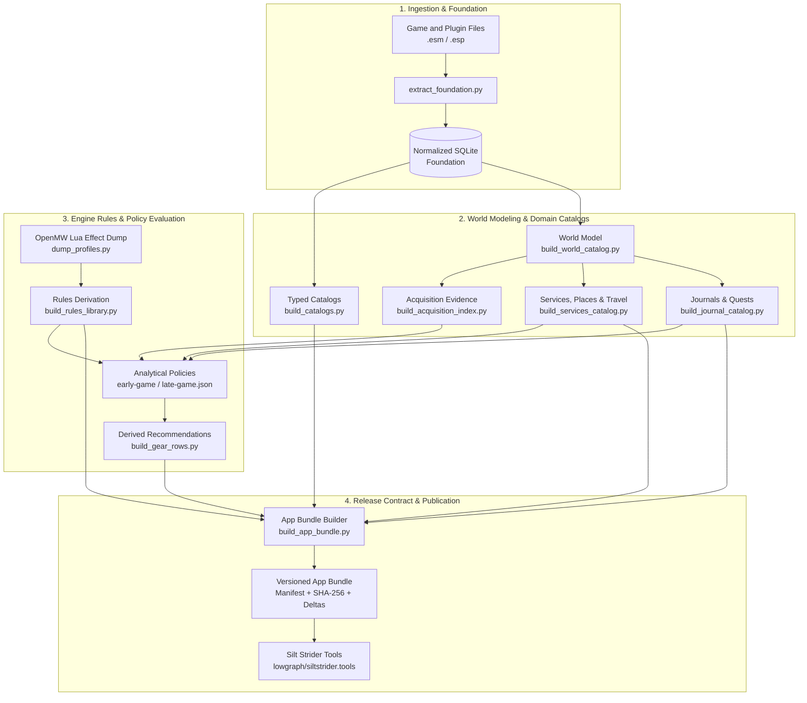

# Silt Strider Data Pipeline

A reproducible ETL and analytical data pipeline that extracts, normalizes, validates, and packages structured game datasets from OpenMW and Morrowind for [Silt Strider Tools](https://siltstrider.tools/).

- **Application Repository**: [`lowgraph/siltstrider.tools`](https://github.com/lowgraph/siltstrider.tools)
- **Live Product**: [siltstrider.tools](https://siltstrider.tools/)
- **Engineering Case Study**: [docs/stages/RULES.md](docs/stages/RULES.md) · [docs/stages/POLICY.md](docs/stages/POLICY.md) · [docs/stages/BUNDLE.md](docs/stages/BUNDLE.md)

---

## 60-Second Overview

This repository is the data-engineering and analytical modeling engine behind **Silt Strider Tools**.

It ingests heterogeneous, 20-year-old binary game and plugin files (`.esm`, `.esp`) from Morrowind, OpenMW, Tamriel Rebuilt, Project Tamriel, and related community mods, transforming them into a normalized, profile-specific SQLite foundation.

The pipeline goes far beyond raw decompilation:

- **Extracts & Normalizes**: Resolves plugin load orders and override precedence across three profiles (`vanilla`, `tr`, `tr_arce`).
- **Models Entity Relationships**: Builds relational graphs of cells, containers, placed references, merchant services, transport networks, and faction requirements.
- **Derives Rules & Evidence**: Discovers bounded item-acquisition paths and joins engine-observed runtime mechanics (from OpenMW Lua dumps) with static record definitions.
- **Evaluates Analytical Policies**: Applies independently versioned recommendation policies (e.g. early-game budget ceilings, danger thresholds, theft tolerances) to raw evidence without altering source observations.
- **Guarantees Data Quality**: Implements executable release gates that halt publication on stale version labels, missing references, or snapshot mismatches.
- **Publishes Content-Addressed Releases**: Emits immutable, SHA-256-verified JSON application bundles with profile inheritance and record deltas for direct browser consumption.

The repository name reflects its origins, but the current project is best understood as a specialized data pipeline and domain modeling platform.

---

## What This Project Demonstrates

1. **Complex ETL & Binary Ingestion**: Parsing complex legacy binary record formats (`TES3` chunk-based streams) and OpenMW runtime state into clean, relational, normalized SQLite schemas.
2. **Strict Separation of Evidence from Policy**: Decoupling pure physical facts (coordinates, container ownership, lock levels, item stats) from analytical policy (spending limits, danger ratings, theft permissions). Modifying recommendation logic never mutates underlying game observations.
3. **Uncertainty & Explicit Negative Handling**: Bounded and truncated graph traversals return explicit `unknown` status rather than falsely asserting negative evidence.
4. **Defense-in-Depth Data Quality**: Replacing manual checklists with executable build guards—stale labels, unlisted plugins, stale engine dumps, or missing entity references immediately abort publication.
5. **Contract-Driven Release Engineering**: Packaging content-addressed application bundles with SHA-256 manifests, byte counts, and delta encoding (`tr_arce` delta over `tr`), ensuring downstream consumers receive deterministic inputs.
6. **Data Lineage & Semantic Correctness**: Tracking data transformations end-to-end to detect and resolve subtle semantic data corruptions (such as container `INTV` condition vs. value confusion) that pass syntactic validation.
7. **Multi-Agent Systems Leadership**: Functioning as the dedicated data producer in a multi-agent workflow, coordinating with downstream consumer agents through versioned, independently validated contracts.

---

## Architecture



The data pipeline and web application repositories communicate through exactly one interface: the versioned, content-addressed application bundle. The web browser reads published JSON catalogs and never connects to raw SQLite extraction databases.

---

## Core Design Principles

### Preserve Provenance
Derived data remains strictly traceable to its extraction snapshot, game-data profile, source plugin, policy version, and OpenMW engine runtime dump.

### Separate Evidence from Judgment
Raw extracted observations and authored analytical policies live in separate layers:

| Layer | Examples | Responsibility |
| --- | --- | --- |
| **Evidence** | Item value, coordinates, container ownership, hostile spawns, lock levels | Extracted facts and physical relationships |
| **Policy** | Max price ceiling (e.g. 500g), theft allowance, acceptable danger ratings | Authored criteria for recommendation scenarios |
| **Derived Result** | Early-game equipment eligibility, best-in-slot ranking | Calculated projections under a specific policy |

Altering a recommendation rule requires changing an isolated JSON policy file—never altering or faking the underlying game observations.

### Preserve Uncertainty
Failure to find evidence is not converted into evidence of absence. Bounded or truncated searches return an explicit `unknown` state rather than an unjustified negative conclusion.

### Refuse Stale or Inconsistent Builds
Known failure conditions stop publication immediately rather than remaining warnings that developers must remember to check manually.

### Content-Addressed Releases
Generated catalogs and application bundles are cryptographically tied to the extraction snapshot from which they were derived. Artifacts from different snapshots cannot silently mix.

---

## Pipeline Stages

The full rebuild workflow executes in dependency order across the following major stages:

### 1. Foundation Extraction
- **Script**: [`extract_foundation.py`](extract_foundation.py)
- **Documentation**: [FOUNDATION.md](docs/stages/FOUNDATION.md)
- Reads approved binary plugins and normalizes raw records into SQLite. Preserves original record bytes and applies ordered override precedence across profiles: `vanilla`, `tr`, and `tr_arce`.

### 2. Typed Catalogs
- **Script**: [`build_catalogs.py`](build_catalogs.py)
- **Documentation**: [CATALOGS.md](docs/stages/CATALOGS.md) · [contracts/catalog-types.ts](contracts/catalog-types.ts)
- Transforms resolved records into typed entities: races, classes, skills, attributes, spells, magic effects, weapons, armor, clothing, ingredients, apparatus, books, enchantments, and game settings.

### 3. World Model
- **Script**: [`build_world_catalog.py`](build_world_catalog.py)
- **Documentation**: [WORLD_CATALOG.md](docs/stages/WORLD_CATALOG.md)
- Builds normalized relational graphs of cells, actors, inventories, world placements, leveled lists, and linked references without eagerly expanding redundant graph paths.

### 4. Journals, Quests, and Script Evidence
- **Scripts**: [`build_journal_catalog.py`](build_journal_catalog.py) · [`build_quest_catalog.py`](build_quest_catalog.py) · [`build_script_evidence.py`](build_script_evidence.py)
- **Documentation**: [JOURNAL_CATALOG.md](docs/stages/JOURNAL_CATALOG.md) · [QUESTS.md](docs/stages/QUESTS.md) · [SCRIPT_EVIDENCE.md](docs/stages/SCRIPT_EVIDENCE.md)
- Models quest stages, completion conditions, dialogue evidence, and uncertainty around scripted item grants.

### 5. Acquisition Evidence
- **Scripts**: [`build_acquisition_index.py`](build_acquisition_index.py) · [`query_item_sources.py`](query_item_sources.py)
- **Documentation**: [ACQUISITION_INDEX.md](docs/stages/ACQUISITION_INDEX.md) · [ITEM_SOURCES.md](docs/stages/ITEM_SOURCES.md)
- Builds bounded reverse-index query structures to determine how any item can be acquired (direct placement, inventory, leveled list, merchant barter, or quest script).

### 6. Services, Merchants, Places, Factions, and Travel
- **Scripts**: [`build_services_catalog.py`](build_services_catalog.py) · [`build_merchant_catalog.py`](build_merchant_catalog.py) · [`build_places_catalog.py`](build_places_catalog.py) · [`build_faction_catalog.py`](build_faction_catalog.py) · [`build_travel_catalog.py`](build_travel_catalog.py) · [`build_intervention_catalog.py`](build_intervention_catalog.py) · [`build_access_catalog.py`](build_access_catalog.py) · [`build_teleport_catalog.py`](build_teleport_catalog.py)
- **Documentation**: [SERVICES_CATALOG.md](docs/stages/SERVICES_CATALOG.md) · [MERCHANTS.md](docs/stages/MERCHANTS.md) · [PLACES.md](docs/stages/PLACES.md) · [FACTIONS.md](docs/stages/FACTIONS.md) · [TRAVEL.md](docs/stages/TRAVEL.md)
- Derives high-level domain datasets for service providers, merchant barter calculations, named geographic places, faction rank progressions, and transportation networks.

### 7. Engine-Derived Rules
- **Scripts**: [`dump_profiles.py`](dump_profiles.py) · [`build_rules_library.py`](build_rules_library.py)
- **Documentation**: [RULES.md](docs/stages/RULES.md)
- Content files alone do not expose all runtime formulas or spell mechanics. [`dump_profiles.py`](dump_profiles.py) launches OpenMW with a Lua dumper to record runtime metadata. The rules library joins engine observations with content usage, categorizing behaviors as confirmed, corrected, or unresolved rather than substituting unverified defaults.

### 8. Analytical Policy & Derived Recommendations
- **Scripts**: [`build_gear_rows.py`](build_gear_rows.py) · [`build_best_in_slot_catalog.py`](build_best_in_slot_catalog.py)
- **Documentation**: [POLICY.md](docs/stages/POLICY.md) · [ROWS.md](docs/stages/ROWS.md) · [BEST_IN_SLOT.md](docs/stages/BEST_IN_SLOT.md)
- Evaluates candidate gear items against authored policy configurations (`policy/early-game.json`, `policy/late-game.json`) to produce recommendations ranked by effective defense, damage, or enchantment capacity.

---

## Data Quality & Release Safeguards

A central priority of the pipeline is migrating known operational failure modes from human documentation into executable release guards.

The pipeline explicitly refuses to build or publish when it encounters:

- **Stale version labels** or mismatched engine dumps
- **Unlisted plugin files** present in approved directories
- **Cross-snapshot artifact mixing** (catalogs generated from different foundation runs)
- **Partial gear runs** targeting production output paths
- **Authored policy references** pointing to non-existent game entities
- **Unsupported engine versions** for transcribed game formulas
- **Inconsistent profile coverage** across sibling datasets
- **Mismatched SHA-256 hashes** or payload sizes during bundle staging

This shifts operational safety from *"remember to check the checklist"* to *"the pipeline cannot publish unless all invariants pass"*. See [REBUILD.md](REBUILD.md) for details.

---

## Case Study: Semantic Data Corruption (INTV)

A concrete example of why end-to-end data lineage matters occurred with the `INTV` field on placed world references.

In TES3 binary records, placed references include an optional integer field (`INTV`):
- For **loose equipment references**, `INTV` represents the item's current condition (durability).
- For **container references**, `INTV` represents the container's lock level or value—**not** the condition of items inside it.

Treating both cases identically caused a severe semantic defect:

```text
Container with INTV = 0
         │
         ▼
Applied erroneously to all items inside container
         │
         ▼
Contained equipment marked as completely broken (Condition = 0)
         │
         ▼
Effective item value recalculated to 0 gold
         │
         ▼
Flawed early-game recommendation (high-end gear recommended as free / cheap)
```

The fix separated the reference interpretation schemas and added automated regression tests covering both loose-item and container references. This illustrates a recurring engineering lesson: **syntactically valid data can still produce corrupted downstream domain results without end-to-end invariant validation.**

---

## Versioned Application Bundle

[`build_app_bundle.py`](build_app_bundle.py) packages pipeline outputs into the versioned contract consumed by [Silt Strider Tools](https://siltstrider.tools/):

- **Optimized for Web Delivery**: Retains only application-relevant catalogs and strips bulk payloads (e.g. raw book text).
- **Cryptographic Verification**: The manifest records exact byte counts and SHA-256 checksums for every catalog file.
- **Profile Inheritance & Delta Encoding**: The `tr_arce` profile inherits base catalogs from `tr` and ships only record-level deltas, minimizing payload size.
- **Content-Derived Identity**: The bundle identifier is computed directly from catalog contents.

See [BUNDLE.md](docs/stages/BUNDLE.md) for the manifest schema.

---

## Testing

Install Python dependencies:

```powershell
python -m pip install -r requirements.txt
```

Run the complete test suite:

```powershell
# For Windows workflows with restricted temp storage:
$env:TEMP='A:\Cache'; $env:TMP='A:\Cache'; python -B -m unittest discover -s . -p "test_*.py"
```

The test suite relies heavily on synthetic fixtures, validating binary parsing, override logic, policy enforcement, graph traversal, and bundle packaging in seconds without requiring full game installations.

Coverage spans:
- Binary plugin extraction and record decoding
- Ordered override precedence across profiles
- Catalog generation and schema validation
- App-bundle packaging, hashing, and delta reconstruction
- Policy evaluation and recommendation ranking
- Acquisition path queries and leveled-list resolution
- Danger, travel, faction, and merchant service calculations
- Rebuild orchestration and failure guards

Downstream consumer tests in the web application repository provide an additional independent layer of contract verification.

---

## Rebuilding

When upstream game plugins or policies change, the pipeline orchestrates a complete rebuild:

```powershell
python rebuild.py
```

The rebuild runner:
1. Executes the test suite first;
2. Executes extraction and transformation stages in dependency order;
3. Halts immediately if any stage fails or detects an invariant violation;
4. Logs detailed stage telemetry;
5. Packages and validates the versioned application bundle;
6. Previews bundle staging for the application repository.

Inspect available stages:

```powershell
python rebuild.py --list
```

Resume execution from a specific stage after addressing an issue:

```powershell
python rebuild.py --from rules
```

See [REBUILD.md](REBUILD.md) before executing a full rebuild against real game files.

---

## Human-Directed, AI-Assisted Development

This repository is developed in a multi-agent workflow:

- **Human Lead**: System architecture, analytical policies, game research, acceptance criteria, and release decisions.
- **Claude (Data Agent)**: Extraction, SQLite modeling, transformation algorithms, and data contracts.
- **Codex (Site Agent)**: Consuming web application at [`lowgraph/siltstrider.tools`](https://github.com/lowgraph/siltstrider.tools).
- **Antigravity (UI Lead)**: UI/UX transformation architecture and CRPG authenticity.

The agents operate within strict repository boundaries: the pipeline agent never writes frontend JSX or CSS, and the application agent never writes extraction scripts or queries raw SQLite databases. Their point of integration is the versioned application bundle contract.

See:
- [COORDINATION.md](COORDINATION.md)
- [AGENTS.md](AGENTS.md)
- [docs/AGENT_PATH_MIGRATION.md](docs/AGENT_PATH_MIGRATION.md)
- [HANDOFF.md](HANDOFF.md)

---

## Repository Map

```text
openmw-decompiler/
├── docs/
│   ├── AGENT_PATH_MIGRATION.md   # Canonical paths and migration history
│   └── stages/                   # Detailed documentation for each pipeline stage
│       ├── FOUNDATION.md         # Binary extraction and SQLite normalization
│       ├── CATALOGS.md           # Typed catalog definitions
│       ├── WORLD_CATALOG.md      # Spatial, cell, and reference modeling
│       ├── ACQUISITION_INDEX.md  # Item placement and reverse-index queries
│       ├── RULES.md              # OpenMW Lua effect dump and rules derivation
│       ├── POLICY.md             # Authored analytical recommendation policies
│       ├── ROWS.md               # Derived equipment recommendations
│       └── BUNDLE.md             # App bundle manifest specification
├── policy/                       # Independently versioned analytical policies (JSON)
├── schemas/                      # SQLite relational schemas for extraction stages
├── contracts/                    # Shared TypeScript catalog type definitions
├── extract_foundation.py         # Binary record extraction entry point
├── build_catalogs.py             # Typed catalog generator
├── build_world_catalog.py        # World and spatial relationship builder
├── build_acquisition_index.py    # Item acquisition index builder
├── build_services_catalog.py     # Merchant, travel, and faction builder
├── dump_profiles.py              # OpenMW Lua runtime effect dumper
├── build_rules_library.py        # Engine mechanics derivation library
├── build_gear_rows.py            # Analytical gear recommendation builder
├── build_app_bundle.py           # Browser application bundle packager
├── rebuild.py                    # Orchestrated rebuild runner
├── AGENTS.md                     # Agent guardrails and operational rules
├── COORDINATION.md               # Cross-repo contract and ownership protocol
├── REBUILD.md                    # Operational guidelines for pipeline execution
└── HANDOFF.md                    # Context and state transfer guide
```

---

## Related Project

The web application consuming this pipeline's published output:

- **Repository**: [`lowgraph/siltstrider.tools`](https://github.com/lowgraph/siltstrider.tools)
- **Live Site**: [siltstrider.tools](https://siltstrider.tools/)
