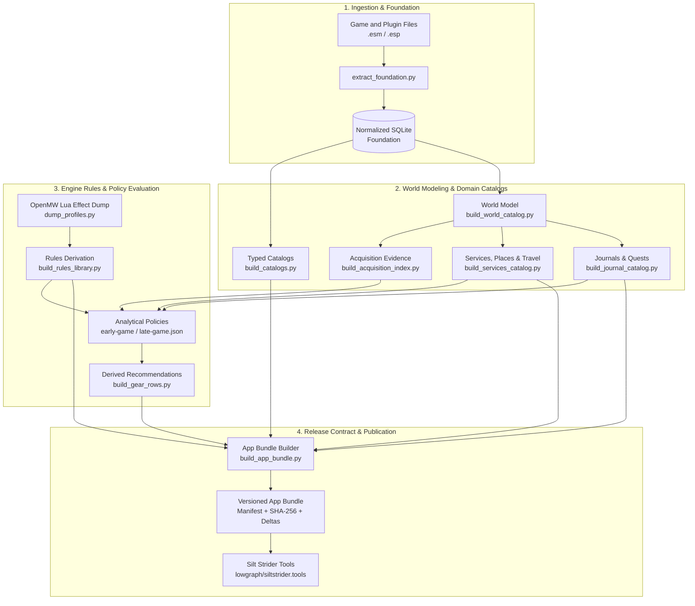

# Silt Strider Data Pipeline

Independent technical project · AI-assisted development

`openmw-decompiler` is the ETL and analytical data-processing project behind
[Silt Strider Tools](https://siltstrider.tools/). It extracts game and mod records,
normalizes them into SQLite, applies validation and authored policies, and packages
structured catalogs with explicit provenance for the web application.

Despite the repository name, its role is game-data extraction and transformation,
not decompilation of the OpenMW engine or reconstruction of its source code.

- **Application Repository**: [`lowgraph/siltstrider.tools`](https://github.com/lowgraph/siltstrider.tools)
- **Live Application**: [siltstrider.tools](https://siltstrider.tools/)
- **Technical References**: [docs/stages/RULES.md](docs/stages/RULES.md) · [docs/stages/POLICY.md](docs/stages/POLICY.md) · [docs/stages/BUNDLE.md](docs/stages/BUNDLE.md)

---

## 60-Second Overview

Game records are spread across binary plugins, ordered overrides and runtime
metadata. The pipeline turns those inputs into consistent, profile-specific
records that the application can query without reading game files or extraction
databases.

Inputs include Morrowind, Tribunal and Bloodmoon `.esm` files, official and mod
`.esm` / `.esp` plugins, configured load orders, authored JSON policies, and
OpenMW Lua runtime dumps. The configured mod profiles include Tamriel Rebuilt,
Project Tamriel and ARCE. Local paths and approved plugins are defined in
[export_config.json](export_config.json) and
[foundation_config.json](foundation_config.json).

The workflow:

- **Extracts & Normalizes**: Resolves plugin load orders and override precedence across three profiles (`vanilla`, `tr`, `tr_arce`).
- **Models Entity Relationships**: Builds relational graphs of cells, containers, placed references, merchant services, transport networks, and faction requirements.
- **Derives Rules & Evidence**: Discovers bounded item-acquisition paths and joins engine-observed runtime mechanics (from OpenMW Lua dumps) with static record definitions.
- **Evaluates Analytical Policies**: Applies independently versioned recommendation policies (e.g. early-game budget ceilings, danger thresholds, theft tolerances) to raw evidence without altering source observations.
- **Checks Data Quality**: Implements executable release gates that halt publication on stale version labels, missing references, or snapshot mismatches.
- **Publishes Content-Addressed Releases**: Emits immutable, SHA-256-verified JSON application bundles with profile inheritance and record deltas for direct browser consumption.

Outputs include normalized SQLite databases for local analysis, typed JSON
catalogs, acquisition evidence, policy-based equipment recommendations, and a
versioned application bundle. Only the bundle is consumed by the site.

---

## Technical Work

1. **ETL & Binary Ingestion**: Parsing legacy binary record formats (`TES3` chunk-based streams) and OpenMW runtime state into clean, relational, normalized SQLite schemas.
2. **Strict Separation of Evidence from Policy**: Decoupling pure physical facts (coordinates, container ownership, lock levels, item stats) from analytical policy (spending limits, danger ratings, theft permissions). Modifying recommendation logic never mutates underlying game observations.
3. **Uncertainty & Explicit Negative Handling**: Bounded and truncated graph traversals return explicit `unknown` status rather than falsely asserting negative evidence.
4. **Data Quality Checks**: Supplementing operational checklists with executable build guards—stale labels, unlisted plugins, stale engine dumps, or missing entity references immediately abort publication.
5. **Versioned Data Contracts**: Packaging content-addressed application bundles with SHA-256 manifests, byte counts, and delta encoding (`tr_arce` delta over `tr`), ensuring downstream consumers receive deterministic inputs.
6. **Data Lineage & Semantic Correctness**: Tracking data transformations end-to-end to detect and resolve subtle semantic data corruptions (such as applying a container reference's `INTV` to its contents' condition) that pass syntactic validation.
7. **Workflow Coordination**: Documenting the producer–consumer boundary, expected catalog schemas, validation rules and handoff commands used by AI coding tools across both repositories.

---

## Architecture



The data pipeline and web application repositories communicate through exactly one interface: the versioned, content-addressed application bundle. The web browser reads published JSON catalogs and never connects to raw SQLite extraction databases.

---

## Core Design Principles

### Preserve Provenance
The foundation preserves original record bytes, plugin hashes, source-plugin
references and load-order precedence. Derived outputs carry an extraction
`snapshotId` and profile; policy-based results and engine rules also record their
policy or runtime-dump basis. These identifiers support tracing a result back to
its inputs without confusing authored recommendations with extracted observations.

### Separate Evidence from Judgment
Raw extracted observations and authored analytical policies live in separate layers:

| Layer | Examples | Responsibility |
| --- | --- | --- |
| **Evidence** | Item value, coordinates, container ownership, hostile spawns, lock levels | Extracted facts and physical relationships |
| **Policy** | Max price ceiling (e.g. 500g), theft allowance, acceptable danger ratings | Authored criteria for recommendation scenarios |
| **Derived Result** | Early-game equipment eligibility, best-in-slot ranking | Calculated projections under a specific policy |

Altering a recommendation rule requires changing an isolated JSON policy file—never altering or faking the underlying game observations.

### Preserve Uncertainty
Failure to find evidence is not converted into evidence of absence. Bounded or truncated searches return an explicit `unknown` state rather than an unjustified negative conclusion.

### Refuse Stale or Inconsistent Builds
Known failure conditions stop publication immediately rather than remaining warnings that developers must remember to check manually.

### Content-Addressed Releases
Catalogs and bundles carry their extraction snapshot and schema versions.
Builders reject mismatched snapshots, while manifests record file hashes and
sizes for downstream integrity checks. Extraction snapshots derive from plugin
fingerprints, profile definitions and extraction settings. Rebuilding unchanged
inputs reproduces the data, but timestamped outputs can have different file hashes;
this is not a promise of byte-identical rebuilds.

---

## Pipeline Stages

The full rebuild workflow executes in dependency order across the following major stages:

### 1. Foundation Extraction
- **Script**: [`extract_foundation.py`](extract_foundation.py)
- **Documentation**: [FOUNDATION.md](docs/stages/FOUNDATION.md)
- Reads approved binary plugins and normalizes raw records into SQLite. Preserves original record bytes and applies ordered override precedence across profiles: `vanilla`, `tr`, and `tr_arce`.

### 2. Typed Catalogs
- **Script**: [`build_catalogs.py`](build_catalogs.py)
- **Documentation**: [CATALOGS.md](docs/stages/CATALOGS.md) · [contracts/catalog-types.ts](contracts/catalog-types.ts)
- Transforms resolved records into typed entities: races, classes, skills, attributes, spells, magic effects, weapons, armor, clothing, ingredients, apparatus, books, enchantments, and game settings.

### 3. World Model
- **Script**: [`build_world_catalog.py`](build_world_catalog.py)
- **Documentation**: [WORLD_CATALOG.md](docs/stages/WORLD_CATALOG.md)
- Builds normalized relational graphs of cells, actors, inventories, world placements, leveled lists, and linked references without eagerly expanding redundant graph paths.

### 4. Journals, Quests, and Script Evidence
- **Scripts**: [`build_journal_catalog.py`](build_journal_catalog.py) · [`build_quest_catalog.py`](build_quest_catalog.py) · [`build_script_evidence.py`](build_script_evidence.py)
- **Documentation**: [JOURNAL_CATALOG.md](docs/stages/JOURNAL_CATALOG.md) · [QUESTS.md](docs/stages/QUESTS.md) · [SCRIPT_EVIDENCE.md](docs/stages/SCRIPT_EVIDENCE.md)
- Models quest stages, completion conditions, dialogue evidence, and uncertainty around scripted item grants.

### 5. Acquisition Evidence
- **Scripts**: [`build_acquisition_index.py`](build_acquisition_index.py) · [`query_item_sources.py`](query_item_sources.py)
- **Documentation**: [ACQUISITION_INDEX.md](docs/stages/ACQUISITION_INDEX.md) · [ITEM_SOURCES.md](docs/stages/ITEM_SOURCES.md)
- Builds bounded reverse-index query structures to determine how any item can be acquired (direct placement, inventory, leveled list, merchant barter, or quest script).

### 6. Services, Merchants, Places, Factions, Travel, and Ingredient Sources
- **Scripts**: [`build_services_catalog.py`](build_services_catalog.py) · [`build_merchant_catalog.py`](build_merchant_catalog.py) · [`build_places_catalog.py`](build_places_catalog.py) · [`build_faction_catalog.py`](build_faction_catalog.py) · [`build_travel_catalog.py`](build_travel_catalog.py) · [`build_intervention_catalog.py`](build_intervention_catalog.py) · [`build_access_catalog.py`](build_access_catalog.py) · [`build_teleport_catalog.py`](build_teleport_catalog.py) · [`build_ingredient_sources.py`](build_ingredient_sources.py)
- **Documentation**: [SERVICES_CATALOG.md](docs/stages/SERVICES_CATALOG.md) · [MERCHANTS.md](docs/stages/MERCHANTS.md) · [PLACES.md](docs/stages/PLACES.md) · [FACTIONS.md](docs/stages/FACTIONS.md) · [TRAVEL.md](docs/stages/TRAVEL.md) · [INGREDIENT_SOURCES.md](docs/stages/INGREDIENT_SOURCES.md)
- Derives domain datasets for service providers, merchant barter calculations, named geographic places, faction rank progressions, transportation networks, and ingredient buying and gathering locations.

### 7. Engine-Derived Rules
- **Scripts**: [`dump_profiles.py`](dump_profiles.py) · [`build_rules_library.py`](build_rules_library.py)
- **Documentation**: [RULES.md](docs/stages/RULES.md)
- Content files alone do not expose all runtime formulas or spell mechanics. [`dump_profiles.py`](dump_profiles.py) launches OpenMW with a Lua dumper to record runtime metadata. The rules library joins engine observations with content usage, categorizing behaviors as confirmed, corrected, or unresolved rather than substituting unverified defaults.

### 8. Analytical Policy & Derived Recommendations
- **Scripts**: [`build_gear_rows.py`](build_gear_rows.py) · [`build_best_in_slot_catalog.py`](build_best_in_slot_catalog.py)
- **Documentation**: [POLICY.md](docs/stages/POLICY.md) · [ROWS.md](docs/stages/ROWS.md) · [BEST_IN_SLOT.md](docs/stages/BEST_IN_SLOT.md)
- Evaluates candidate gear items against authored policy configurations (`policy/early-game.json`, `policy/late-game.json`) to produce recommendations ranked by effective defense, damage, or enchantment capacity.

---

## Data Quality & Release Safeguards

A central priority of the pipeline is migrating known operational failure modes from human documentation into executable release guards.

Checks across extraction, bundle generation and downstream staging reject:

- **Stale version labels** or mismatched engine dumps
- **Unlisted plugin files** present in approved directories
- **Cross-snapshot artifact mixing** (catalogs generated from different foundation runs)
- **Partial gear runs** targeting production output paths
- **Authored policy references** pointing to non-existent game entities
- **Unsupported engine versions** for transcribed game formulas
- **Inconsistent profile coverage** across sibling datasets
- **Mismatched SHA-256 hashes** or payload sizes during bundle staging

These checks catch known failure modes before a release is staged; they do not
replace review of data semantics or new failure cases. See [REBUILD.md](REBUILD.md)
for the guards and recovery commands.

---

## Case Study: Semantic Data Corruption (INTV)

A concrete example of why end-to-end data lineage matters occurred with the `INTV` field on placed world references.

In TES3 binary records, placed references include an optional integer field (`INTV`):
- For **loose equipment references**, `INTV` represents the item's current condition (durability).
- For **container references**, a value on the container reference does not describe
  the condition of its contents. Lock levels are read separately from `FLTV`.

Treating both cases identically caused a severe semantic defect:

```text
Container with INTV = 0
         │
         ▼
Applied erroneously to all items inside container
         │
         ▼
Contained equipment marked as completely broken (Condition = 0)
         │
         ▼
Effective item value recalculated to 0 gold
         │
         ▼
Flawed early-game recommendation (high-end gear recommended as free / cheap)
```

Policy evaluation now uses condition only from the item's own reference, with automated regression tests covering both loose-item and container references. This illustrates a recurring data-validation problem: **syntactically valid data can still produce corrupted downstream domain results without end-to-end invariant validation.**

---

## Versioned Application Bundle

[`build_app_bundle.py`](build_app_bundle.py) packages pipeline outputs into the versioned contract consumed by [Silt Strider Tools](https://siltstrider.tools/):

- **Optimized for Web Delivery**: Retains only application-relevant catalogs and strips bulk payloads (e.g. raw book text).
- **Cryptographic Verification**: The manifest records exact byte counts and SHA-256 checksums for every catalog file.
- **Profile Inheritance & Delta Encoding**: The `tr_arce` profile inherits base catalogs from `tr` and ships only record-level deltas, minimizing payload size.
- **Release Identity**: The bundle identifier incorporates the extraction snapshot,
  schema versions, selected profiles and derived-catalog source filenames. Per-file
  SHA-256 hashes verify the packaged bytes independently.

See [BUNDLE.md](docs/stages/BUNDLE.md) for the manifest schema.

---

## Technologies

The workflow uses Python, SQLite and JSON, with Python's standard-library binary
parsing and hashing utilities. `jsonschema` validates item schemas; TypeScript
interfaces in `contracts/` document catalog shapes. OpenMW and Lua provide runtime
metadata that plugin records do not expose. Node.js and npm are needed for the
site's bundle-staging and consumer-test steps in a full rebuild.

## Testing

Install Python dependencies:

```powershell
python -m pip install -r requirements.txt
```

Run the complete test suite:

```powershell
# For Windows workflows with restricted temp storage:
$env:TEMP='A:\Cache'; $env:TMP='A:\Cache'; python -B -m unittest discover -s . -p "test_*.py"
```

The test suite relies heavily on synthetic fixtures, validating binary parsing, override logic, policy enforcement, graph traversal, and bundle packaging in seconds without requiring full game installations.

Coverage spans:
- Binary plugin extraction and record decoding
- Ordered override precedence across profiles
- Catalog generation and schema validation
- App-bundle packaging, hashing, and delta reconstruction
- Policy evaluation and recommendation ranking
- Acquisition path queries and leveled-list resolution
- Danger, travel, faction, and merchant service calculations
- Rebuild orchestration and failure guards

Downstream consumer tests in the web application repository provide an additional independent layer of contract verification.

---

## Rebuilding

When upstream game plugins or policies change, the pipeline orchestrates a complete rebuild:

```powershell
python rebuild.py
```

The rebuild runner:
1. Executes the test suite first;
2. Executes extraction and transformation stages in dependency order;
3. Halts immediately if any stage fails or detects an invariant violation;
4. Logs detailed stage telemetry;
5. Packages and validates the versioned application bundle;
6. Stages the validated bundle in the application repository, checks its published
   best-in-slot data against the site's builds, and runs the site's tests.

Inspect available stages:

```powershell
python rebuild.py --list
```

Resume execution from a specific stage after addressing an issue:

```powershell
python rebuild.py --from rules
```

Inspect [export_config.json](export_config.json) and
[foundation_config.json](foundation_config.json) for local game, engine, cache and
profile paths before running a rebuild on another machine. Full extraction requires
separately installed game/mod files and OpenMW; synthetic tests do not.
See [REBUILD.md](REBUILD.md) before executing a full rebuild against real game files.

---

## Development Approach

This is independent project work developed with AI assistance. I define the data
workflow, expected outputs, analytical policies, provenance requirements,
validation rules, test cases and acceptance criteria. My work includes reviewing
generated implementations, debugging and refining transformations, validating
outputs, and documenting behavior and release checks.

AI coding tools, including Claude, Codex and Antigravity, assist with implementation
and iteration. Extraction and transformation belong in this repository; interfaces
and application data consumption belong in
[`lowgraph/siltstrider.tools`](https://github.com/lowgraph/siltstrider.tools).
The versioned JSON bundle is their data interface. Agent specialties and handoffs
are documented in the coordination files, rather than enforced as exclusive
editing roles.

See:
- [COORDINATION.md](COORDINATION.md)
- [AGENTS.md](AGENTS.md)
- [docs/AGENT_PATH_MIGRATION.md](docs/AGENT_PATH_MIGRATION.md)
- [HANDOFF.md](HANDOFF.md)

---

## Repository Map

```text
openmw-decompiler/
├── docs/
│   ├── AGENT_PATH_MIGRATION.md   # Canonical paths and migration history
│   └── stages/                   # Detailed documentation for each pipeline stage
│       ├── FOUNDATION.md         # Binary extraction and SQLite normalization
│       ├── CATALOGS.md           # Typed catalog definitions
│       ├── WORLD_CATALOG.md      # Spatial, cell, and reference modeling
│       ├── ACQUISITION_INDEX.md  # Item placement and reverse-index queries
│       ├── RULES.md              # OpenMW Lua effect dump and rules derivation
│       ├── POLICY.md             # Authored analytical recommendation policies
│       ├── ROWS.md               # Derived equipment recommendations
│       └── BUNDLE.md             # App bundle manifest specification
├── policy/                       # Independently versioned analytical policies (JSON)
├── schemas/                      # SQLite relational schemas for extraction stages
├── contracts/                    # Shared TypeScript catalog type definitions
├── extract_foundation.py         # Binary record extraction entry point
├── build_catalogs.py             # Typed catalog generator
├── build_world_catalog.py        # World and spatial relationship builder
├── build_acquisition_index.py    # Item acquisition index builder
├── build_services_catalog.py     # Actor services and transport relationships
├── dump_profiles.py              # OpenMW Lua runtime effect dumper
├── build_rules_library.py        # Engine mechanics derivation library
├── build_gear_rows.py            # Analytical gear recommendation builder
├── build_app_bundle.py           # Browser application bundle packager
├── rebuild.py                    # Orchestrated rebuild runner
├── AGENTS.md                     # Agent guardrails and operational rules
├── COORDINATION.md               # Cross-repo contract and ownership protocol
├── REBUILD.md                    # Operational guidelines for pipeline execution
└── HANDOFF.md                    # Context and state transfer guide
```

---

## Related Project

The web application consuming this pipeline's published output:

- **Repository**: [`lowgraph/siltstrider.tools`](https://github.com/lowgraph/siltstrider.tools)
- **Live Site**: [siltstrider.tools](https://siltstrider.tools/)

## Licence

Copyright (C) 2026 lowgraph.

This pipeline is free software: you can redistribute it and/or modify it under the terms
of the **GNU General Public License** as published by the Free Software Foundation, either
version 3 of the License, or (at your option) any later version (`GPL-3.0-or-later`),
like OpenMW itself. See [LICENSE](LICENSE).

Not covered by that licence:

- **Game and mod data.** The Elder Scrolls III: Morrowind, Tribunal and Bloodmoon belong
  to Bethesda Softworks and ZeniMax Media; Tamriel Rebuilt, Project Tamriel and ARCE
  belong to their teams. The pipeline reads your own copies of those files; what it
  extracts from them is theirs, and none of it is in this repository except the small
  sample records in `items/examples/`, excerpts of Morrowind's data kept to
  document the output format.
- **The Silt Strider name and logo**, which are not licensed for reuse.
